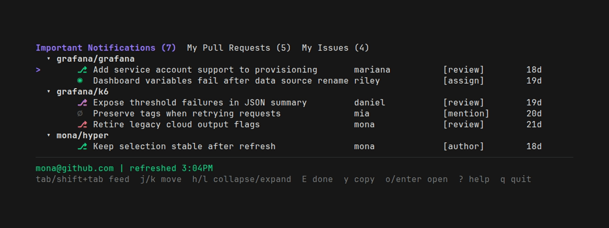

# hyper

[](https://github.com/sethrylan/hyper/releases)
[](https://github.com/sethrylan/hyper/actions)

A terminal UI for your GitHub work queue: important notifications, open PRs, and open issues — grouped by repo, updated in real time.



## Install

Download the [latest release](https://github.com/sethrylan/hyper/releases), or:

```sh
go install github.com/sethrylan/hyper/cmd/hyper@latest
```

Requires [GitHub CLI](https://cli.github.com/) authentication:

```sh
gh auth login
```

## Use

```sh
hyper
```

| Key | Action |
|-----|--------|
| `tab` / `shift+tab` | Switch feed |
| `j` / `k` | Move down / up |
| `l` / `h` | Expand / collapse group |
| `o` / `enter` | Open in browser |
| `y` | Copy URL |
| `E` | Mark done (Important Notifications) |
| `r` | Refresh |
| `?` | Help |
| `q` | Quit |
