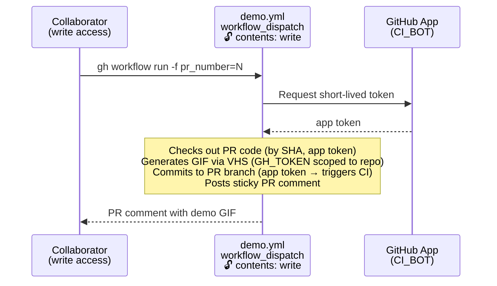

# Demo

The `demo.gif` in the project README is generated on-demand using the `demo` workflow.

**To generate**: `gh workflow run demo.yml -f pr_number=<PR_NUMBER>` or use the Actions tab → "demo" → "Run workflow".

## How It Works

- **[demo-setup.sh](demo-setup.sh)** - Builds the `hyper` binary and installs it. Run from the repo root:
  ```sh
  docs/demo-setup.sh
  ```
- **[demo.tape](demo.tape)** - A [VHS](https://github.com/charmbracelet/vhs) script that records a terminal session as a GIF.

The demo workflow sets `GH_TOKEN` to the Actions `GITHUB_TOKEN`, which is scoped to this repository. The recorded session shows the hyper TUI loading and navigating data from this repo.

## Pitfalls of Writing to Pull Requests

The demo workflow needs to run on a pull request and write to the same PR branch. This introduces 3 interconnected challenges:

1. **Triggering workflow runs**. By [design](https://docs.github.com/en/actions/how-tos/write-workflows/choose-when-workflows-run/trigger-a-workflow#triggering-a-workflow-from-a-workflow), a commit by GitHub Actions's token cannot trigger a workflow (directly or indirectly) to prevent infinite loops. But most repo's branch protection rules require checks to pass on the latest commit.
2. **Circular workflow dispatch**. If we can solve #1, then we must protect against a new commit being pushed to the PR branch triggering the same workflow again, creating a loop.
3. **Arbitrary code execution**. If we can solve #1 and #2, then we need to protect against the workflow running untrusted code from the PR, while still permitting the workflow to write the generated files to the PR branch.

### Solution to #1: Triggering workflow runs

This workflow creates a short-lived GitHub App token (`CI_BOT_APP_ID` / `CI_BOT_APP_PRIVATE_KEY`) and uses it for both `actions/checkout` and the subsequent `git push`. Pushes authenticated as a GitHub App do trigger downstream CI workflows, so required checks run on the demo GIF commit.

### Solution to #2: Protecting against circular workflow dispatch

The demo workflow uses the `workflow_dispatch` trigger, which can only be invoked manually (via CLI or Actions tab). This eliminates circular triggers entirely.

### Solution to #3: Mitigating arbitrary code execution

The demo workflow must protect against a [pwn request](https://securitylab.github.com/resources/github-actions-preventing-pwn-requests/) attack. The demo workflow uses `workflow_dispatch`, which can [only be triggered](https://docs.github.com/en/actions/writing-workflows/choosing-when-your-workflow-runs/events-that-trigger-workflows#workflow_dispatch) by users with write access to the repository. This eliminates the untrusted input vector.



#### `demo.yml`

- Triggered by `workflow_dispatch` with a `pr_number` input — only invocable by users with write access to the repository
- Checks out the PR by commit SHA to avoid TOCTOU issues
- Passes `GITHUB_TOKEN` as `GH_TOKEN` so hyper can authenticate to GitHub during recording
- Generates the demo GIF and commits it to the PR branch
- Posts a sticky PR comment with the generated GIF
